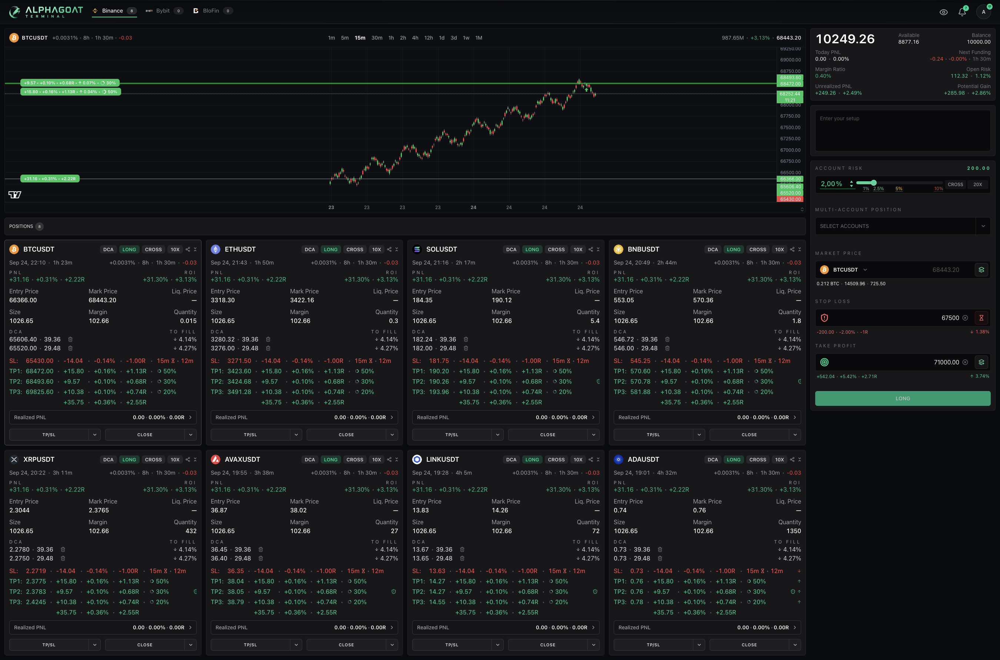
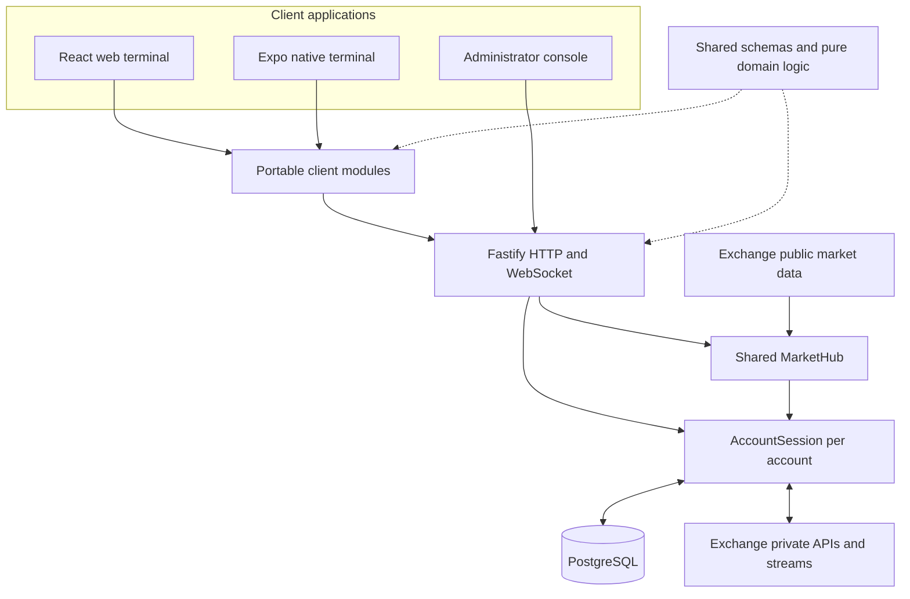

# AlphaGoat Terminal

[Website](https://alphagoat.app) · [Open terminal](https://terminal.alphagoat.app)

**A multi-exchange trading terminal built around risk, reliable execution, and a shared web/native architecture.**

AlphaGoat brings account management, market charts, risk-based position sizing, multi-account execution, stop protection, staged exits, and trade history into one workspace. The project includes a React web terminal, an Expo native client, a Fastify backend, an administrator console, and a statically rendered product website.

This repository presents the architecture and selected implementation details of the private application.

## Contents

- [Product and workflows](#product-and-workflows)
- [Interface](#interface)
- [Technology stack](#technology-stack)
- [System architecture](#system-architecture)
- [Backend design](#backend-design)
- [Data and financial correctness](#data-and-financial-correctness)
- [Web and native clients](#web-and-native-clients)
- [Testing and delivery](#testing-and-delivery)
- [Runnable code example](#runnable-code-example)
- [Technical documentation](#technical-documentation)

## Product and workflows

The central workflow starts with a risk budget. A trader selects an account and market, defines the entry, stop, and targets, and reviews a position sized from those inputs. The same workflow can include additional entries, multiple take-profit levels, and linked positions across accounts.

| Capability | Product behavior |
| --- | --- |
| Risk-based entry | Size a position from wallet risk, stop distance, contract size, and exchange quantity constraints. |
| Market and limit orders | Apply the relevant order-type rules while retaining one entry workflow. |
| DCA and staged exits | Allocate entries and exits across price levels with reusable presets. |
| Position management | Adjust protection, request additional exposure through a revised risk plan, move the stop to entry, or close a selected percentage. |
| Hard and soft stops | Support exchange-native stop orders and server-owned candle-close conditions. |
| Multi-account execution | Prepare target accounts, track each execution separately, and coordinate linked protection and closing. |
| Live synchronization | Reflect changes originating in the terminal or directly on the exchange. |
| History and analytics | Present closed trades, cumulative net P&L, win rate, profit factor, drawdown, and risk-relative results. |
| Signal parsing | Turn structured or free-form signal text into an editable trading setup, with server-owned parsing and validation. |
| Account and access management | Manage exchange connections, presets, security methods, invitations, and administrative access. |

The enabled onboarding catalog includes Binance, Bybit, BloFin, and Bitunix. A Hyperliquid adapter is implemented behind a disabled catalog entry. Each venue keeps its own order semantics behind the normalized application contract.

## Interface

The screenshot uses production terminal components in a dedicated Storybook scenario. All market data, balances, positions, and returns shown are synthetic demonstration data.

### Full trading workspace

The desktop workspace brings the candlestick chart, order annotations, account balances, and risk-based entry form together with eight open positions. Position cards show P&L, DCA orders, soft stops, take-profit allocations, and management controls across BTC, ETH, SOL, BNB, XRP, AVAX, LINK, and ADA.

[](assets/terminal-overview.png)

[Open the full-resolution screenshot →](assets/terminal-overview.png)

## Technology stack

| Area | Technologies | Responsibility in this project |
| --- | --- | --- |
| Language and workspace | TypeScript, ESM, pnpm workspaces | Strict boundaries across applications, portable client code, schemas, and domain calculations. |
| Web application | React, Vite, TanStack Router, React Compiler | Static SPA delivery, file-based routing, generated route splitting, and compiled component memoization. |
| Client state | TanStack Query, Zustand, React Hook Form | Separate HTTP caches, streaming state, and editable form drafts. |
| Interface | Tailwind CSS, Radix UI, Framer Motion, Lucide | Shared styling conventions, accessible interaction primitives, motion, and iconography. |
| Financial charts | Lightweight Charts; shared chart calculations | Candlesticks, price annotations, and financial overlays; portable calculations with platform-specific renderers. |
| Native application | React Native, Expo Router, Reanimated, Skia, SecureStore | Native navigation, graphics and gestures, device lifecycle, and durable client recovery storage. |
| Backend | Node.js, Fastify, HTTP and WebSocket | API composition, authenticated commands, live publications, and account runtime lifecycle. |
| Exchange integrations | CCXT, venue-specific adapters and public scopes | Normalize provider APIs while retaining exact order identities and venue constraints. |
| Contracts and arithmetic | Zod, decimal.js | Runtime transport validation, explicit unknown states, and decimal financial calculations. |
| Persistence | PostgreSQL, Drizzle, pg | Durable intent, operations, fills, income, historical coverage, authentication, and migrations. |
| Authentication | Better Auth, WebAuthn/passkeys, TOTP integration | Database-backed sessions, gated authentication methods, and action-specific assurance. |
| Signal extraction | OpenAI SDK, strict schemas, versioned parser cache | Convert signal text into the existing form contract, with admission control and request history. |
| Component development | Storybook | Isolated presentation fixtures, edge states, numeric-width scenarios, and accessibility inspection. |
| Verification | Vitest, Playwright, Biome, Oxlint, Fallow | Domain and integration testing, browser behavior, formatting, static rules, dead-code and complexity checks. |
| Hosting and edge | Cloudflare, Vultr VPS, Ubuntu | Public DNS and proxying, with an Ubuntu host running the application infrastructure. |
| Containers | Docker, Docker Compose | Reproducible runtime images, service configuration, health checks, networking, and persistent volumes. |
| Delivery | GitHub Actions, Nginx, host supervisor | Automated checks, immutable builds, static serving, serialized deployment, and recovery. |
| Observability | Pino, Prometheus, Grafana, Loki, Alloy | Structured diagnostics, runtime metrics, dashboards, logs, and alerts. |

[Technology choices and how the tools fit together →](docs/technology-stack.md)

## System architecture

The backend is a feature-oriented application with one active trading runtime. Private account state, shared market data, persistent records, and client interaction have explicit owners.



The monorepo separates deployable applications from reusable behavior:

```text
apps/
  server/          Fastify API, trading runtime, persistence, exchange adapters
  web/             React terminal and browser interaction
  mobile/          Expo native application
  admin/           User access and operational administration
  landing/         Prerendered product site and interactive fixture demos
packages/
  shared/          Transport schemas and pure financial logic
  client/          Portable transport, stores, recovery, and feature behavior
  design-tokens/   Semantic tokens and generated platform output
```

Dependencies follow responsibility. Shared contracts do not import application code. Portable client modules do not depend on React or a device platform. Web and native own rendering and lifecycle integration. The landing consumes explicit presentation exports with static fixtures.

[Architecture and package boundaries →](docs/architecture.md)

## Backend design

The backend is organized by product feature: accounts, orders, positions, protection, market data, history, notifications, authentication, and signals. Fastify composes these owners directly.

`AccountSession` is the authoritative aggregate for one account. It decides which exchange facts may be adopted, whether a command can be admitted, and when a new terminal revision is ready. Acquisition, command execution, persistence, protection, and projection have concrete collaborators inside that boundary.

The core command path is:

```text
Authenticated request
  → strict validation and account ownership
  → durable admission with an exact operation identity
  → exchange dispatch
  → factual readback and reconciliation
  → atomic durable settlement
  → terminal publication
  → client completion
```

Exchange acceptance, database settlement, and visible completion are separate steps. If a response is lost, the original command remains identifiable and recovery observes its outcome. An uncertain financial mutation is not automatically submitted a second time.

Network acquisition can overlap, while adoption of results remains serialized and fenced against newer account generations and commands. Shared public market streams serve account runtimes and client subscriptions without creating an account-local copy of every public connection.

[Backend internals and lifecycle →](docs/backend-architecture.md) · [Command recovery →](docs/command-recovery.md)

## Data and financial correctness

The exchange owns current positions, orders, balances, and executable settings. PostgreSQL owns product intent, durable command state, fills, income, historical coverage, and user data. A stored terminal snapshot is a last-known projection; the runtime reacquires current exchange facts after a restart.

Financial values cross boundaries as decimal strings. Calculations explicitly account for contract size, price steps, quantity increments, minimum order constraints, and settlement currency. Formatting a number for display does not redefine an executable order value.

History requires completeness as well as deduplication. A collection of fill rows does not prove that an interval is fully known, so the model retains certified coverage alongside normalized records. Structural records and their coverage advance atomically. Delayed fills remain attached to their original position lifecycle, even after the same symbol is reopened.

[Data modeling, precision, and transaction boundaries →](docs/data-correctness.md)

## Web and native clients

Client responsibilities are divided into three kinds of state: HTTP data, live server publications, and local interaction. TanStack Query owns lower-frequency queries; portable Zustand stores own streamed views and market frames; form owners retain editable drafts and transient validation.

The server publishes render-ready financial views. Entry estimates and protection previews can calculate synchronously from server-provided facts, but remain drafts until an explicit command completes.

Account generations and terminal revisions prevent late messages from crossing an account switch or overwriting newer state. Reconnect and mobile resume restore observation of existing operations while retaining the user's draft. A valuation update can change a balance only when it belongs to the matching current terminal revision.

Web and native share this behavior through `packages/client`. Navigation, charts, storage integration, gestures, and rendering remain platform-owned.

[Real-time clients and cross-platform reuse →](docs/realtime-clients.md)

## Testing and delivery

The verification strategy places each problem at the layer that can reproduce it precisely: pure financial calculations, stateful adapter contracts, account-runtime scenarios, real PostgreSQL transactions, and full-stack browser journeys. A deterministic fake exchange makes delayed responses, partial outcomes, and reconnect ordering reproducible.

Architecture checks also enforce package and transport ownership. Storybook handles presentation exploration, while Playwright exercises the connected application. Static analysis covers type safety, formatting, custom rules, unused code, duplication, and complexity.

Production is hosted on an Ubuntu VPS at Vultr, with Cloudflare in front of the public domains. Host Nginx serves static applications and proxies API and WebSocket traffic to Fastify. Docker and Docker Compose run the backend, PostgreSQL, and the separately managed monitoring stack; a host supervisor controls the trading runtime lifecycle.

The release pipeline combines automated code and behavior checks, production builds in GitHub Actions, and controlled deployment on the host. Docker images and static assets are retained as immutable release artifacts; the host supervisor applies one deployment at a time. A full release drains work, proves the old process has stopped, migrates, starts the successor, and waits for fresh account readiness before reopening traffic. Static component updates have a separate compatibility-gated path.

Structured logs and metrics follow commands through admission, provider scheduling, readback, persistence, publication, and client presentation. That makes a slow visible result diagnosable beyond a single HTTP duration.

[Testing strategy →](docs/testing-strategy.md) · [CI/CD and observability →](docs/delivery-and-verification.md)

## Runnable code example

The [risk-based entry example](examples/README.md) extracts a complete piece of the shared domain layer, including its TypeScript source, tests, and a local demo. It starts with a concrete scenario: a 1,000 USDT wallet, a 2% risk budget, and two entries sharing one stop. The walkthrough follows that intent through contract sizing, per-order rounding, and exchange constraints to the final order plan.

It can be run independently of the private application. [Read the scenario and run the code →](examples/risk-based-entry/README.md)

## Technical documentation

| Document | Topics |
| --- | --- |
| [Technology stack](docs/technology-stack.md) | Tools, responsibilities, integration choices, and frontend/native details. |
| [Architecture](docs/architecture.md) | System boundaries, package dependencies, state ownership, and deployment shape. |
| [Backend architecture](docs/backend-architecture.md) | Composition, account aggregate, scheduling, adapters, transactions, sagas, and lifecycle. |
| [Command recovery](docs/command-recovery.md) | Timeouts, durable identity, uncertain outcomes, readback, and Close All target inventory. |
| [Data correctness](docs/data-correctness.md) | Decimal arithmetic, history continuity, attribution, and migration integrity. |
| [Real-time clients](docs/realtime-clients.md) | HTTP/cache/store boundaries, revisions, reconnect, and native reuse. |
| [Testing strategy](docs/testing-strategy.md) | Test layers, fake exchanges, PostgreSQL, browser journeys, and structural checks. |
| [Deployment and observability](docs/delivery-and-verification.md) | Cloudflare, VPS hosting, Docker Compose, CI/CD, recovery, and monitoring. |
| [Design decisions](docs/design-decisions.md) | Rationale and trade-offs behind the main architectural choices. |
| [Runnable code example](examples/README.md) | Risk-based entry sizing: worked inputs and outputs, full domain code, and behavioral tests. |
