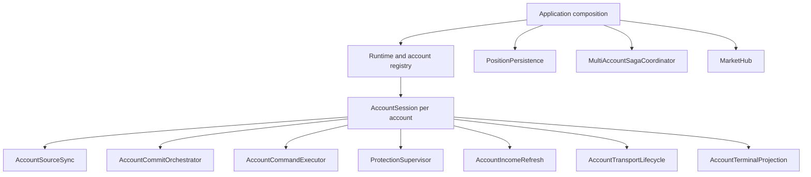

# Backend architecture

[Overview](../README.md) · [System boundaries](architecture.md) · [Command recovery](command-recovery.md)

The backend combines a conventional API surface with long-lived account runtimes. HTTP requests are short-lived, but exchange subscriptions, protective strategies, unresolved operations, and historical acquisition continue beyond any individual browser request.

The design separates request handling from lifecycle ownership while keeping both in one active Node.js process.

## Feature-first organization

```text
apps/server/src/
  accounts/       Metadata, credentials, routes, and connection changes
  account-state/  Source acquisition, history continuity, refresh scheduling
  auth/           Sessions, assurance, provider methods, socket admission
  balance/        Account valuation and income-derived balance presentation
  db/             Schema, migrations, and database composition
  exchanges/      Normalized interfaces, venue adapters, public scopes
  history/        Closed trades, attribution, and performance summaries
  market/         Shared catalogs, tickers, candles, and subscriptions
  notifications/  Durable inbox and user read state
  orders/         DCA, take-profit levels, cancellation, and rebalance
  positions/      Position lifecycle, execution, increase, and closing
  protection/     Hard Stop, Soft Stop, risk-free rules, and recovery
  presets/        Reusable allocation plans
  runtime/        Account ownership, commands, settlement, and publication
  signals/        Parsing, caching, cooldown admission, and request history
  monitoring/     Metrics and observational runtime diagnostics
  app.ts          Fastify composition
```

These are product boundaries. A position feature can own its queries, calculations, and command preparation together. It does not need matching controller, service, and repository classes that only forward calls.

## Composition and ownership

`buildApp` composes Fastify routes and request-level dependencies. `createRuntime` constructs persistent collaborators and the account registry. The resulting graph has a concrete set of lifecycle owners:



The collaborators do concrete work, but `AccountSession` retains authoritative account state and permission to adopt and publish it.

| Owner | Responsibility |
| --- | --- |
| `AccountSourceSync` | Acquire the required source scope and coordinate refresh demand. |
| `AccountCommitOrchestrator` | Prepare and commit a candidate under the account's fencing and settlement rules. |
| `AccountCommandExecutor` | Track admission, dispatch, outcome classification, readback, and completion. |
| `ProtectionSupervisor` | Own server-side protection work and its timers or candle subscriptions. |
| `AccountIncomeRefresh` | Acquire and settle income through its independent freshness lane. |
| `AccountTransportLifecycle` | Own private connection resources and replacement cleanup. |
| `AccountTerminalProjection` | Materialize the render-ready view and publish it with a revision after permission is granted. |
| `PositionPersistence` | Own position-domain transactions across the process. |
| `MultiAccountSagaCoordinator` | Track immutable group targets and account-local outcomes. |
| `MarketHub` | Share normalized public market sources and route updates to consumers. |

## Follow an entry command through the backend

1. **Authenticate and decode.** The route verifies the session, account ownership, client capabilities, and strict request shape.
2. **Admit.** The account runtime checks current authority, continuity, relevant coverage, and conflicts. It persists the exact operation and normalized intent before an external side effect.
3. **Prepare.** The feature validates the setup against current instrument and account constraints. Venue-specific configuration belongs to the adapter boundary.
4. **Dispatch.** The exchange call uses the original operation identity, with an unknown dispatch outcome recorded before the call can take effect.
5. **Observe.** Readback and private events supply factual execution and protection information. An acknowledgement can advance knowledge without completing the whole workflow.
6. **Settle.** The owning transaction commits the required feature facts and operation completion. A failed local write does not authorize another exchange command.
7. **Publish.** A render-ready account revision is emitted after the required state has committed. The client correlates the operation with its receipt and publication.

This path explains why route success, exchange acceptance, and UI completion have different meanings.

## Concurrent acquisition, serialized adoption

Acquiring data can be slow. Serializing every provider request would make background history or a full account snapshot block urgent work. The source owner distinguishes full, targeted entry, and account-wide open-state demand.

Independent acquisition can overlap. Applying a result goes through the account owner, which rechecks whether the candidate still belongs to the current connection generation, source scope, and command state.

For example, an open-order read may start before a new Hard Stop command. If it returns afterwards, adopting it blindly could make the new stop appear absent and trigger incorrect reconciliation. Source and command fences reject that stale candidate.

Generation checks also protect reconnect and account replacement. Cancellation releases resources where possible, but a late callback must still fail its ownership check when a provider ignores cancellation.

## Exchange boundary and scheduling

Adapters translate provider payloads into the normalized account contract. Raw symbols and protocol-specific structures stay within the integration. Provider-issued order and execution identities are retained where recovery needs exact correlation.

Hedge versus net position mode, separate conditional orders, symbol configuration, settlement currency, and available history evidence affect what an adapter can promise. These differences are represented explicitly.

Binance has a process-owned request-admission scheduler shared by its public and private clients. It distinguishes control, interactive, and background work; bounds pending and physically active requests; reserves capacity for higher-priority work; and incorporates rate-limit feedback. A caller's logical timeout does not release a physical slot while the underlying request is still running.

Those limits control local work. They do not create financial retries or replace account admission and settlement rules.

## Public and private streams

Private streams belong to account lifecycles. Public catalogs and market streams belong to shared credential-free scopes keyed by exchange, environment, and market type.

The market hub normalizes a batch once and indexes interested consumers by symbol. Coalescing keeps the newest useful value when updates outpace publication cadence. Consumer failures and downstream socket queues are isolated.

Losing a public price source makes the affected financial frame unavailable; it does not automatically invalidate every private account connection.

## Transactions and projections

PostgreSQL records durable intent and historical evidence. Account settlement uses the relevant lock and authority checks to commit a coherent transition. Structural fills and certified coverage move together; operation, target, group, and receipt updates preserve their owning transaction boundaries.

`AccountTerminalProjection` derives a view from reconciled inputs, assigns the publication revision, and retains the matching checkpoint. That checkpoint cannot authorize trading after restart.

Durable event facts required by a financial transition commit with it. Notification wording and live delivery run afterwards. A delivery failure can be retried as notification work without replaying a financial command or revoking an established account revision.

## Multi-account operations

A batch is a set of account-local operations with an immutable target inventory. The coordinator owns correlation and group settlement; each account keeps its own exchange and runtime authority.

One account can reject while another accepts or remains uncertain. The group reports those actual outcomes rather than pretending that several external systems participate in one ACID transaction.

This is a concrete saga for the implemented workflows. Recovery reads feature-owned durable state; it is not a generic job engine. It does not invent a compensating trade to conceal a partial result.

## Startup, reconnect, and shutdown

Startup reconstructs pending work from durable records and reacquires current exchange facts. Accounts with exposure can restore protection without requiring an open browser tab. Dormant empty accounts acquire resources according to demand.

Reconnect retires the old generation, closes its resources, and begins factual recovery. Physical cleanup matters: a timer expiring or a database lock disappearing does not prove that an old exchange client can no longer act.

Shutdown closes admission, drains accepted work, and proves resource closure. Deployment uses the same discipline before starting a successor. Independent account failures remain scoped where possible instead of terminating the entire API process.

## Authentication, administration, and parsing

HTTP uses database-backed sessions; a one-use ticket admits a socket. The server can revoke indexed sockets when authentication authority changes. Administrative runtime views distinguish current and last-known data and do not create an alternative trading interface.

Signal extraction has a separate availability boundary. The parser owns normalized input, structured provider output, caching, request history, and per-user cooldown. Its short database admission transaction finishes before provider work starts. Parser failure does not stop account protection or take ownership of financial recovery.
