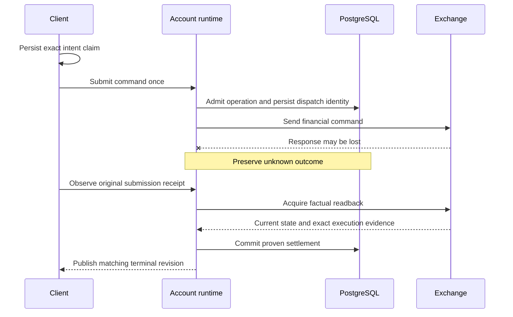

# Case study: a timeout is not a rejected trade

[Overview](../README.md) · [Data correctness](data-correctness.md)

Consider a user submitting an entry order. The exchange accepts it, but the response is lost before the client sees completion. The client cannot safely infer either success or failure from the timeout. Automatically submitting again could create a second order.

## Bind recovery to the original operation

An admitted financial command has an exact identity, target, conflict scope, durable intent, and required readback. Dispatch records an unknown outcome before a possible side effect. A factual exchange rejection and an uncertain transport outcome remain different results.

For entry and protection, the client also persists an intent claim before dispatch. Browser storage uses IndexedDB; native storage uses an awaited SecureStore aggregate. An equal unresolved intent joins recovery of its original submission. This local journal preserves uncertainty across interruption; it is not an offline trading queue.

This diagram shows a resolvable lost-response path. Some operations remain indeterminate when exact evidence cannot be obtained within their persisted observation budget. The system must retain that historical uncertainty.

## Completion requires more than acknowledgement

A protected action completes after its required exchange facts, durable bookkeeping, settlement, and matching terminal publication. HTTP acceptance alone does not establish that the position is protected and visible.

The protocol preserves distinctions between admission, exchange acceptance, durable settlement, and presentation. They are separate milestones both in recovery logic and in latency diagnosis.

Exact retries observe the original identity. They do not automatically replay an uncertain create, edit, cancel, or close. A multi-step workflow may continue only separately proven remaining steps of the already authorized operation.

## Recovery has a bounded cost

Observation budgets persist with the operation. Restarting the process or refreshing the page must not grant a fresh unlimited attempt budget. Reaching a budget limit does not turn unknown into rejected.

Historical uncertainty and permission to admit a later explicit command are separate questions. New admission requires current authority and the relevant committed coverage, continuity, and conflict checks. It cannot rely on the mere age of the previous operation.

## Close All illustrates why identity matters

A Close All operation retains its admitted lifecycle and pending-order inventory. If a new position opens later on the same symbol, it does not become a target of the old command. If an original pending order fills, its resulting lifecycle is correlated through execution identity.

“There are no positions now” is weaker evidence than “every original target has a proven outcome.” The distinction matters after a restart and when exchange events arrive out of order.

## Alternatives and costs

| Approach | Consequence |
| --- | --- |
| Retry every timed-out mutation | Simple interaction, but can repeat a financial side effect. |
| Treat timeout as rejection | Misrepresents an order that may already exist. |
| Freeze the account forever after any unknown result | Conservative, but unnecessarily blocks later work even when new factual coverage can prove safe admission. |
| Retain identity and reconcile exact evidence | More durable state and tests; preserves the distinction between a historical unknown and current actionable facts. |

The application does not claim universal exactly-once execution across a third-party exchange. It controls local admission and replay, records uncertainty, and resolves outcomes only from sufficient evidence.
