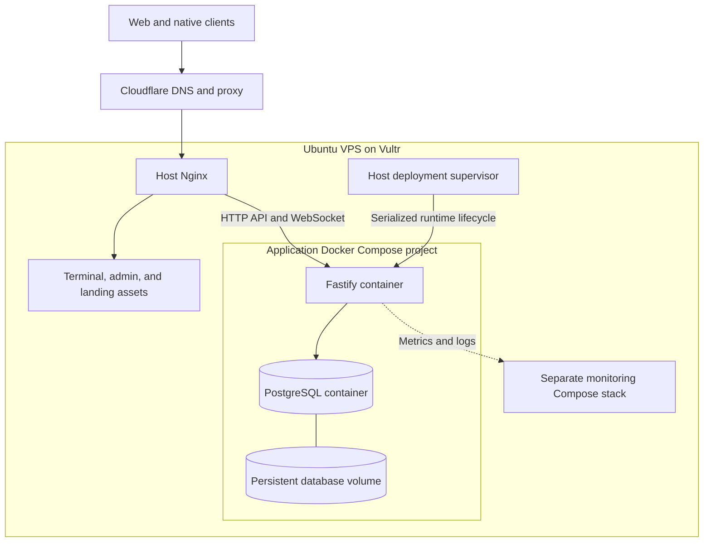
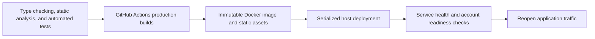

# Deployment, CI/CD, and observability

[Overview](../README.md)

A trading application needs a release process that preserves operation ownership and makes failure recoverable. A successful image build proves a different fact from a healthy, freshly reconciled account on the deployed server.

## Hosting and runtime topology

The application is hosted on an **Ubuntu VPS at Vultr**, with **Cloudflare** in front of its public domains. **Docker** packages the runtime, and **Docker Compose** describes the application services and their persistent resources.

| Layer | Responsibility |
| --- | --- |
| Cloudflare | Public DNS and proxying; the deployment design adds Cloudflare Access around administrative surfaces. |
| Vultr VPS and Ubuntu | Host operating system, Docker Engine, Nginx, and the deployment supervisor. |
| Docker | Immutable backend images and isolated service processes. |
| Docker Compose | Service definitions, environment wiring, health checks, startup dependencies, networking, and volumes. |
| Host Nginx | Serve static applications and forward API and WebSocket traffic to the backend's loopback-bound port. |
| Persistent PostgreSQL volume | Retain application data across container replacement. |
| Host supervisor | Serialize deployment and recovery while preserving one active trading runtime. |

Compose checks that PostgreSQL is healthy before starting the server. The server's automatic Docker restart policy is disabled: its supervisor must verify runtime identity and ownership before a restart. The monitoring stack has a separate configuration lifecycle, so an application release can leave unchanged monitoring containers running.

This topology keeps operation on one host explicit. Host failure affects availability, and a full runtime replacement has a maintenance window. Container health checks, persistent storage, and supervised recovery each address a different part of that operating model.

## CI/CD pipeline

The release tooling coordinates local verification, GitHub Actions builds, and host deployment. Automated checks cover application behavior, database integration, package boundaries, and deployment configuration. GitHub-hosted runners build the production backend image and static applications.

Deployment is explicitly initiated after verification. Building an artifact and activating it on the host are separate stages, allowing the release process to check compatibility before interrupting the running application.

Images are addressed by digest, and an artifact manifest identifies the components of a release. Deployment retries reuse those retained artifacts. This keeps a retry tied to the same binaries and static assets instead of producing a different build halfway through recovery.

## Runtime replacement and maintenance

The host supervisor owns one serialized operation independently of an SSH session or workflow lifetime. A full release verifies compatibility, closes admission, drains work, proves predecessor termination, migrates, and starts one successor.

Reopening traffic requires fresh account recovery above the recorded revision floors. A running process or an Nginx switch alone does not establish readiness.

Server-owned strategy follow-up pauses during stop/start. This is an explicit cost of the single-runtime architecture. Static applications have a separate update path with compatibility checks, allowing eligible frontend changes to be served without replacing the trading runtime.

## Test the failure boundaries

| Layer | Representative question |
| --- | --- |
| Pure domain tests | Are sizing, allocation, and decimal calculations correct at boundary inputs? |
| Adapter contracts | Do venue-specific responses normalize into the promised contract? |
| Account runtime tests | Can a stale source result overwrite a newer command or connection generation? |
| PostgreSQL integration | Do operation facts and their completion records commit together across restart? |
| Browser behavior | Does the UI wait for factual publication, retain drafts, and recover from interruption? |
| Deployment tests | Does maintenance preserve single ownership and require fresh readiness before reopening? |
| Architecture checks | Are platform imports and transport ownership still within their intended boundaries? |

Stateful fake exchanges and disposable PostgreSQL environments make controlled failures repeatable. The E2E control plane is installed only through a dedicated test entrypoint. Ordinary production routes do not expose its controls.

The browser runner continues through the selected test batch after an individual failure and reports an aggregate result, so independent failures remain visible in the same run.

## Observe the entire user-visible operation

Opening latency can include admission, provider scheduling, exchange acceptance, factual readback, persistence, publication, network delivery, client application, and presentation.

Structured logs correlate those stages by operation, account, connection, and revision. Metrics cover account readiness, history repair, stream demand, admission failures, and publication work. High-cardinality account or order identities belong in bounded diagnostic context rather than being added indiscriminately to metric labels.

Prometheus, Grafana, Loki, and Alloy support investigation. Monitoring remains observational: a dashboard cannot authorize an order or turn last-known exposure into current truth.

## Recovery and compatibility

A retained release artifact supports an exact deployment retry. Rollback additionally requires an image that can read the current schema and persisted operation data. The host retains failed-operation state so a retry can inspect what already happened rather than replay every step blindly.
